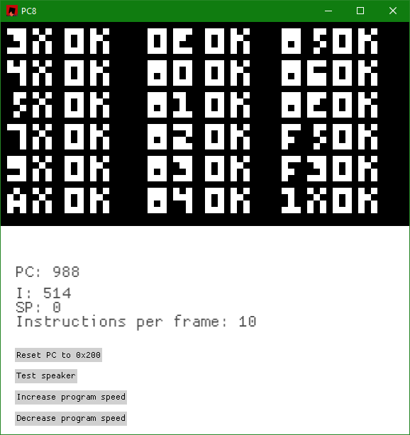

# PC8

PC8 is a very simple (and even malfunctioning) [CHIP-8](https://en.wikipedia.org/wiki/CHIP-8) interpreter.
The code isn't very pretty but this is meant to be a quick and dirty project for fun. The only good thing is the total separation of the VM and the renderer, allowing for multiple frontends.
The renderer is powered by [macroquad](https://macroquad.rs/) and only renders out the video graphics that the interpreter writes to.

Here's a showcase of PC8 running the [chip8-test-rom](https://github.com/corax89/chip8-test-rom).

